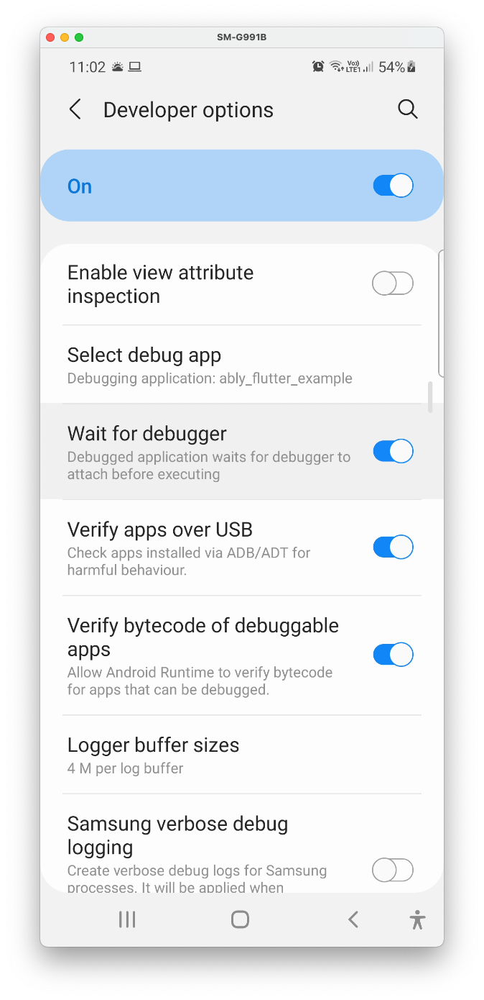
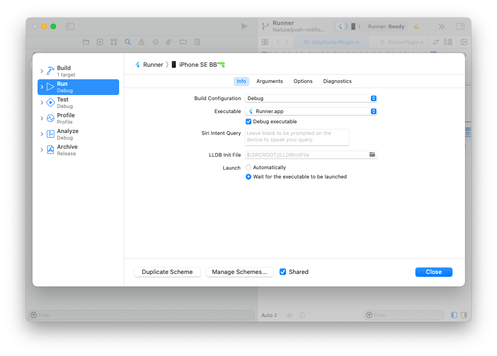
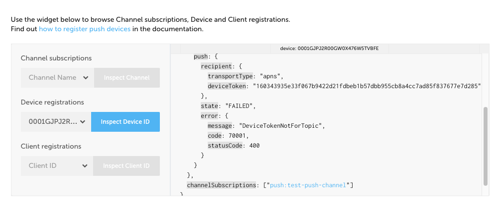

# Push Notifications

Push Notifications allow you to reach users who have your application in the foreground, background and terminated, including when your application is not connected to Ably. Push notifications allow you to run code and show alerts to the user. On iOS, Ably connects to [APNs](https://developer.apple.com/library/archive/documentation/NetworkingInternet/Conceptual/RemoteNotificationsPG/APNSOverview.html) to send messages to devices. On Android, Ably connects to [Firebase Cloud Messaging](https://firebase.google.com/docs/cloud-messaging/) to send messages to devices. As both services do not guarantee message delivery and may even throttle messages to specific devices based on battery level, message frequency, and other criteria, messages may arrive much later than sent or ignored.

## Known Limitations
 
- [Activating devices from your server](https://ably.com/documentation/general/push/activate-subscribe#activation-from-server): Device activation is automatic in ably-flutter, just call `Push#activate`. However, Ably-java and ably-cocoa allow you to implement delegate methods to activate devices manually on your server instead of automatically.
- [Push Admin API](https://ably.com/documentation/general/push/admin): The Push APIs in this SDK are limited to managing the push notification features related to current device. The Push Admin API allows you to manage device registrations and subscriptions related to other devices. This is functionality designed for servers.
- [Push Registrations cannot be updated on Android: fails with `No authentication information provided`](https://github.com/ably/ably-flutter/issues/167). If you listen to `activationEvents.onUpdateFailed`, you should get an error: `No authentication information provided`. This is a problem you would commonly face during development, since FCM may change the device token when the app is reinstalled. However, this is less of a problem in production. 

## Supported platforms

- Android API level 19+ (Android 4.4+)
    - Android devices
    - Android emulator (with Google APIs)
- iOS 10+
    - Physical devices only
    - **Not supported:** iOS Simulator. Calling [`UIApplication:registerForRemoteNotifications`](https://developer.apple.com/documentation/uikit/uiapplication/1623078-registerforremotenotifications) will result in [`application:didFailToRegisterForRemoteNotificationsWithError`](https://developer.apple.com/documentation/uikit/uiapplicationdelegate/1622962-application) method being called in your AppDelegate with an error: `remote notifications are not supported in the simulator`). This is an iOS simulator limitation.
    
## Setting up the Example App

To get push notifications setup in your own app, read [Setting up your own app](#setting-up-your-own-app).

### Android

- Update the application ID (`applicationId "io.ably.flutter.plugin_example"`) in the example application in `example/android/app/build.gradle` to a unique application ID.
- Create a Firebase project, and in the Project settings, add an android app with your unique application ID. Follow the steps provided on the setup process, or the following:
    - You can leave `Debug signing certificate SHA-1` empty.
    - Download the generated `google-services.json` file
    - Place `google-services.json` in `example/android/app/`. We have `gitignore`d this file since it is associated with our Firebase project, but it is [not sensitive](https://stackoverflow.com/questions/37358340/should-i-add-the-google-services-json-from-firebase-to-my-repository), so you can commit it to share it with other developers/colleagues.
- Provide ably with the FCM server key: In your [firebase project settings](https://knowledge.ably.com/where-can-i-find-my-google/firebase-cloud-messaging-api-key), create or use an existing cloud messaging server key, and enter it in your Ably app's dashboard (App > Notifications tab > Push Notifications Setup > Setup Push Notifications).

### iOS

- You need to have a [Apple developer program](https://developer.apple.com/programs/) membership ($99/year)
- Open your iOS app in Xcode: when in your project directory, run `xed ios` or double click `ios/Runner.xcworkspace` in `your_project_name/ios`
    - Add your developer account in Xcode, in `Preferences` > `Accounts`.
    - In the project navigator, click `Runner` > Click `Runner` target (not project) > `General`. Change the bundle identifier to a unique identifier. Then, under the `Signing & Capabilities` tab > `Team` dropdown menu, select your developer team associated with your developer account. This will register your bundle ID on App Store connect if it is not yet registered.
    - Create a push notification certificate (`.p12`) and upload it to the Ably dashboard to allow Ably to authenticate with APNs on your behalf, using [How do I obtain the APNs certificates needed for iOS Push Notifications?](https://knowledge.ably.com/how-do-i-obtain-the-apns-certificates-needed-for-ios-push-notifications).
    - Add `Push Notifications` capability: Click Runner in project navigator, click `Runner` target, under the **Signing & Capabilities** tab, click `+ Capability`, and select `Push Notifications`.
    - Add `remote notification` background mode:
        - Under the **Signing & Capabilities** tab, click `+ Capability` and select `Background Modes`.
        - Check `remote notifications`.

## Setting up your own App

### Android

- Create a Firebase project if you do not have one
- Tip: Follow the steps below with Android Studio opened with the Android project, instead of the flutter project.
- Set up Firebase in your Android app, following only the [Set up the SDK](https://firebase.google.com/docs/cloud-messaging/android/client#set_up_the_sdk) and [Edit your app manifest](https://firebase.google.com/docs/cloud-messaging/android/client#manifest) steps from the Firebase guide. The guide will instruct you to create a firebase project, add the firebase configuration file (`google-services.json`), add the `google-services` to the classpath (`classpath`), and apply the plugin (`apply plugin:`) the `app` module.
- In your `app/build.gradle`, ensure that your `minSdkVersion` is set to 19 or above.
- Add your android app to the firebase project
- Provide ably with the FCM server key: In your [firebase project settings](https://knowledge.ably.com/where-can-i-find-my-google/firebase-cloud-messaging-api-key), create or use an existing cloud messaging server key, and enter it in your Ably app's dashboard (App > Notifications tab > Push Notifications Setup > Setup Push Notifications).
- Handle messages received on your device by extending [`FirebaseMessagingService`](https://firebase.google.com/docs/reference/android/com/google/firebase/messaging/FirebaseMessagingService). An example is shown in the example app, [`PushMessagingService`](./example/android/app/src/main/java/io/ably/flutter/plugin_example/PushMessagingService.java). This is the service class you specify in the `AndroidManifest.xml`. For more information, have a look at the [receiving messages](#receiving-messages) section.

### iOS

- You need to have a [Apple developer program](https://developer.apple.com/programs/) membership ($99/year)
- Open your iOS app in Xcode: when in your project directory, run `xed ios` or double click `ios/Runner.xcworkspace` in `your_project_name/ios`
    - Ensure your application bundle ID is registered on App Store connect. This is done automatically by Xcode when you select your team under `Signing & Capabilities`.
    - Create a `.p12` certificate and upload it to the Ably dashboard to allow Ably to authenticate with APNs on behalf of you, using [How do I obtain the APNs certificates needed for iOS Push Notifications?](https://knowledge.ably.com/how-do-i-obtain-the-apns-certificates-needed-for-ios-push-notifications).
       - When running your application via Xcode or your machine (Android Studio, command line), your application runs in either debug, profile or release mode. In all cases, your application will use the sandbox/development APNs environment. When distributing your app in the App Store, Ad Hoc or through App Store Connect, it will always use the production environment. If distributing through `Development`, the sandbox / development APNs environment is used. Keep in mind your distribution method when checking the `Use APNS sandbox environment?` checkbox in an Ably application on the Ably dashboard (notifications tab). Ensure your application connects to an Ably application configured to use production APNs if the application is being distributed publicly.
    - Add `Push Notifications` capability: Click Runner in project navigator, click `Runner` target, under the **Signing & Capabilities** tab, click `+ Capability`, and select `Push Notifications`.
    - Add `remote notification` Background mode:
        - Under the **Signing & Capabilities** tab, click `+ Capability` and select `Background Modes`.
        - Check `remote notifications`.
- In your `AppDelegate.swift` or `AppDelegate.m`, implement [`application:didFailToRegisterForRemoteNotificationsWithError:`](https://developer.apple.com/documentation/uikit/uiapplicationdelegate/1622962-application). An example is shown in the example app, [`AppDelegate.m`](./example/ios/Runner/AppDelegate.m). 
- During development, place a breakpoint in this method to diagnose why your device cannot register with APNs. This method will be called when there is an error, for example, if entitlements are not configured or when registering for APNs on the iOS simulator. You can check the `error` argument. If an error occurs in this method, Ably will not get the APNs device token. [From the `application(_:didFailToRegisterForRemoteNotificationsWithError:)` documentation](https://developer.apple.com/documentation/uikit/uiapplicationdelegate/1622962-application):
> UIKit calls this method if it was unable to register your app with APNs or if your app is not properly configured for remote notifications. During development, make sure your app has the proper entitlements and that its App ID is configured to support push notifications. You might use your implementation of this method to make a note of the failed registration so that you can try again later.
- Like the example app, you do not need to implement [`UIApplication:registerForRemoteNotifications`](https://developer.apple.com/documentation/uikit/uiapplication/1623078-registerforremotenotifications), as the Ably plugin does this for you at app launch.
- Handle messages received on your device by implementing the methods in your `AppDelegate`, such as `didReceiveRemoteNotification`, `didReceiveNotificationResponse` and `willPresentNotification`. This is shown in the example app, [`AppDelegate.m`](./example/ios/Runner/AppDelegate.m). For more information, have a look at the [receiving messages](#receiving-messages) section.

## Usage

### Summary

Devices need to be [activated](#device-activation) with Ably once. Once activated, you can use their device ID, client ID or push token (APNs device token/ FCM registration token) to push messages to them using the Ably dashboard or a [Push Admin](https://ably.com/documentation/general/push/admin) (SDKs which provide push admin functionality, such as [Ably-java](https://github.com/ably/ably-java), [Ably-js](https://github.com/ably/ably-js), etc.). However, to send push notifications through Ably channels, devices need to [subscribe to a channel for push notifications](#subscribing-to-channels-for-push-notifications). Once subscribed, messages on that channel with a [push payload](#sending-messages) will be sent to devices which are subscribed to that channel.

The example app contains an example of how to use the Push Notification functionality in [`push_notification_service.dart`](./example/lib/push_notifications/push_notification_service.dart).

### Ensure `WidgetsBinding` is initialized

If you invoke any methods from the `ably_flutter` package before calling `runApp()`, you must call `WidgetsFlutterBinding.ensureInitialized();`. This is done to ensure all platform methods will be successfully received by the native Ably plugin on the host platform.

### Device activation

- Create a rest or realtime client: e.g. `final realtime = ably.Realtime(options: clientOptions);`
- Activate the device for push notifications with Ably: `ablyClient.push.activate();`. This only
  needs to be done once, and will be used across all future app launches, as long as the app is not deactivated. This method will throw an AblyException if it fails.
- The `Future` returned by `activate` is not guaranteed to complete quickly. For example, if there is no internet connection, `activate` will wait until it is available. Therefore, there is no guarantee any code awaiting the completion of the `Future` will run.

```dart
try {
  await push.activate();
} on ably.AblyException catch (error) {
  // Handle/ log the error.
}
```

- Listen to push events: You should listen to the `Push.pushEvents.onUpdateFailed` stream to be informed when a new token update (FCM registration token / APNs device token) fails to be updated with Ably. If this update process fails, Ably servers will attempt to use the old tokens to send messages to devices and potentially fail.
    - Optional: listen to `Push.pushEvents.onActivate` and `Push.pushEvents.onDeactivate`. This is optional because `Push.activate` and `Push.deactivate` will return when it succeeds, and throw when it fails.

```dart
void main() {
  setUpPushEventHandlers();
  runApp(MyApp());
}

void setUpPushEventHandlers() {
  ably.Push.pushEvents.onUpdateFailed.listen((error) async {
    print(error);
  });
  ably.Push.pushEvents.onActivate.listen((error) async {
    print(error);
  });
  ably.Push.pushEvents.onDeactivate.listen((error) async {
    print(error);
  });
}
```

### Subscribing to channels for push notifications

- Get the Realtime/ Rest channel: `final channel = realtime!.channels.get(Constants.channelNameForPushNotifications)`
- Subscribe the device to the **push channel**, by either using the device ID or client ID:
    - `channel.push.subscribeClient()` or `channel.push.subscribeDevice()`
    - This is different to subscribing to a channel for messages.
- Your device is now ready to receive and display user notifications (called alert notifications on iOS and notifications on Android) to the user, when the application is in the background.
- For debugging: You could use the Ably dashboard (notification tab) or the Push Admin API using another SDK to ensure the device has been subscribed by listing the subscriptions on a specific channel. Alternatively, you can list the push channels the device or client is subscribed to: `final subscriptions = channel.push.listSubscriptions()`. This API requires Push Admin capability, and should be used for debugging. This means you must use an Ably API key or token with the `push-admin` capability.

### Notification Permissions (iOS only)

Requesting permissions:

- Understand the iOS platform behavior: 
    - The first time your app makes this authorization request, the system prompts the user to grant or deny the request and records the user’s response. Subsequent authorization requests don’t prompt the user. - [
    Asking Permission to Use Notifications](https://developer.apple.com/documentation/usernotifications/asking_permission_to_use_notifications)
    - This means it is important to choose the moment you request permission from the user. Once a user denies permission, you would need to ask the user to go into the Settings app and give your app permission manually.
- Request permissions using `Push#requestPermission`, passing in options such as badge, sound, alert and provisional. See API documentation for more options.
- To avoid showing the user a permission alert dialog, you can request provisional permissions with `Push#requestPermission(provisional: true)`. The notifications will be delivered silently to the notification center, where the user will be able opt-in to deliver messages from your app prominently in the future.

```dart
// Create an Ably client to access the push field
final realtime = ably.Realtime(options: clientOptions);
final push = realtime.push;
// Request permission from user on iOS
bool permissionGranted = await push.requestPermission();
// Get more information about the notification settings
if (Platform.isIOS) {
  final notificationSettings = await realtime.push.getNotificationSettings();
}
```

### Sending Messages

#### Notification Message / Alert Push Notification

Shows a notification to the user immediately when it is received by their device.

**Android**: This is known as a [notification message](https://firebase.google.com/docs/cloud-messaging/concept-options). A notification message cannot be customised or handled (e.g. run logic when a user taps the notification) - therefore, if you need to handle user taps or customize a notification, send a data message and [create a local notification](https://developer.android.com/guide/topics/ui/notifiers/notifications).

**iOS**: This is known as an [alert push notification](https://developer.apple.com/documentation/usernotifications/). An alert notification can be [customised](https://developer.apple.com/documentation/usernotificationsui/customizing_the_appearance_of_notifications).

To send a user notification, publish the following message to the channel:

```dart
final message = ably.Message(
  data: 'This is an Ably message published on channels that is also sent '
      'as a notification message to registered push devices.', // Optional data field sent not sent in push messages.
  extras: const ably.MessageExtras({
    'push': {
      'notification': {
        'title': 'Hello from Ably!',
        'body': 'Example push notification from Ably.',
        'sound': 'default',
    },
  },
}));
```

#### Data Message / Background Notification

Allows you to run logic in your application, such as download the latest content, perform local processing and creating a local notification.

**Android**: This is known as a [data message](https://firebase.google.com/docs/cloud-messaging/concept-options).

**iOS**: This is known as a background notification. These messages must have a priority of `5`, a push-type of `background`, and the `content-available` set to `1`, as shown in the code snippet below. To learn more about the message structure required by APNs, read [
Pushing Background Updates to Your App](https://developer.apple.com/documentation/usernotifications/setting_up_a_remote_notification_server/pushing_background_updates_to_your_app). You may see this documented as "silent notification" in Firebase documentation.

On iOS, a background notification may not be throttled to 2 or 3 messages per hour, or limited for other reasons (for example, your app was just installed recently). To ensure your messages arrive promptly, you may send a message with both notification and data, which will show a notification to the user.

```dart
final _pushDataMessage = ably.Message(
data: 'This is a Ably message published on channels that is also '
    'sent as a data message to registered push devices.',
  extras: const ably.MessageExtras({
    'push': {
      'data': {'foo': 'bar', 'baz': 'quz'},
      'apns': {
        'apns-headers': {
          'apns-push-type': 'background',
          'apns-priority': '5',
        },
        'aps': {
          'content-available': 1
        }
    } 
  },
}));
```

#### Prioritising messages

Only use high priority when it requires immediate user attention or interaction. Use the normal priority (5) otherwise. Messages with a high priority wake a device from a battery saving state, which drains the battery even more.
- High priority: `'priority': 'high'` inside `push.fcm.android` for Android. `apns-priority: '10'` inside `push.apns.apns-headers` for iOS.
- Normal priority: `'priority': 'normal'` inside `push.fcm.android` for Android. `apns-priority: '5'` inside `push.apns.apns-headers` for iOS.

#### Alert Notification **and** Background / Data Message

Push notifications containing both the notification and data objects will be treated as both alert notifications and data messages.

```dart
final message = ably.Message(
  data: 'This is an Ably message published on channels that is also sent '
      'as a notification message to registered push devices.',
  extras: const ably.MessageExtras({
    'push': {
      'notification': {
        'title': 'Hello from Ably!',
        'body': 'Example push notification from Ably.',
        'sound': 'default',
    },
    'data': {'foo': 'bar', 'baz': 'quz'},
    'apns': {
    'aps': {'content-available': 1}
  },
}));
```

### Receiving Messages

For examples of handling incoming messages and dealing with notifications, see [push_notification_handlers](example/lib/push_notifications/push_notification_handlers.dart) in the example app. There are 2 types of push notifications:
- Notifications to your user (alert push notification on iOS, notification message on Android), and 
- Notifications to your app (background notification on iOS, data message on Android)

#### Notification Message / Alert Push Notification

**Android**: If the app is in the background / terminated, you cannot configure / disable notification messages as they are automatically shown to the user by Firebase Messaging Android SDK. To create notifications which launch the application to a certain page (notifications which contain deep links or app links), or notifications which contain buttons / actions, images, and inline replies, you should send a data message and create a notification when the message is received. 

**iOS**: If the app is in the background / terminated, ably-flutter doesn't provide the functionality to configure / extend alert notifications on iOS, and these will automatically be shown to the user.

To create local notifications with more content or user interaction options once a data message is received on both Android and iOS, take a look at [awesome_notifications](https://pub.dev/packages/awesome_notifications).
  - Advanced usage: 
    - To do this natively on Android instead, you could use [`notificationManager.notify`](https://developer.android.com/reference/android/app/NotificationManager#notify(int,%20android.app.Notification)). 
    - To do this natively on iOS, you can send a background message and follow [Scheduling a Notification Locally from Your App](https://developer.apple.com/documentation/usernotifications/scheduling_a_notification_locally_from_your_app). However, on iOS, you could also [customize the appearance of an alert notification](https://developer.apple.com/documentation/usernotificationsui/customizing_the_appearance_of_notifications), by registering and implementing a [`UNNotificationContentExtension`](https://developer.apple.com/documentation/usernotificationsui/unnotificationcontentextension).

The SDK does this by implementing [`userNotificationCenter(_:willPresent:withCompletionHandler:)`](https://developer.apple.com/documentation/usernotifications/unusernotificationcenterdelegate/1649518-usernotificationcenter). This feature is not available on Android.

#### Data Message / Background Notification

- On iOS, if a notification is also present, it will be shown
  -  **before** `onMessage` is called, and
  -  **before** the callback you set using `ably.Push.notificationEvents.setOnBackgroundMessage` is called.
- On Android, if a notification is also present, it will be shown
  - **after** `onMessage` is called, and
  - **after** the callback you set using `ably.Push.notificationEvents.setOnBackgroundMessage` is called.
- When the app is in the foreground, you can listen to messages using:

```dart
ably.Push.notificationEvents.onMessage.listen((remoteMessage) {
  print('Message was delivered to app while the app was in the foreground: '
      '$remoteMessage');
});
```
- This method can be synchronous or `async`.

- When the app is terminated or in the background, you can listen to messages using:

```dart
Future<void> _backgroundMessageHandler(ably.RemoteMessage message) async {
  print('Just received a background message, with:');
  print('RemoteMessage.Notification: ${message.notification}');
  print('RemoteMessage.Data: ${message.data}');
}
ably.Push.notificationEvents.setOnBackgroundMessage(_backgroundMessageHandler);
```
- This method can be synchronous or `async`.
- On Android, when a message is received whilst the app is terminated, Ably Flutter will launch your application to process the message. Ably Flutter listens to the message by registering a broadcast receiver. This means your `MainActivity` will not be launched, and so your native setup code (e.g. creating method channels) you may have written in your `MainActivity`'s `configureFlutterEngine` method will not be run. If you want your `configureFlutterEngine` to run even when Ably launches your application, refactor this code into a Flutter package plugin, implementing [`FlutterPlugin`](https://api.flutter.dev/javadoc/io/flutter/embedding/engine/plugins/FlutterPlugin.html) and move your logic inside `onAttachedToEngine`.

#### Notification taps

- To be informed when a notification tap launches the app:

```dart
ably.Push.notificationEvents.notificationTapLaunchedAppFromTerminated
    .then((remoteMessage) {
  if (remoteMessage != null) {
    print('The app was launched by the user by tapping the notification');
    print(remoteMessage.data);
  }
});
```
  
- To be informed when a notification is tapped by the user whilst the app is in the foreground:

```dart
ably.Push.notificationEvents.onNotificationTap.listen((remoteMessage) {
  print('Notification was tapped: $remoteMessage');
});
```

#### Showing/hiding foreground notifications

On iOS, ably-flutter allows you to configure notification sent directly from Ably to be shown when the app is in foreground. To configure if a notification is shown in the foreground:

```dart
ably.Push.notificationEvents.setOnShowNotificationInForeground((message) async {
  // TODO add logic to show notification based on message contents. 
  print('Opting to show the notification when the app is in the foreground.');
  return true;
});
```

#### Advanced: native message handling

Users can listen to messages in each platform using the native message listeners instead of Dart listeners. This is not recommended unless you want to **avoid** using other plugins, such as [awesome_notifications](https://pub.dev/packages/awesome_notifications) and [flutter_local_notifications](https://pub.dev/packages/flutter_local_notifications). Another reason to use your own native message handling is to avoid conflicts with other dependencies.

**Android**: This requires you to implement [`FirebaseMessageService`](https://firebase.google.com/docs/cloud-messaging/android/receive) and override the `onMessageReceived` method. You must also declare this service in your `AndroidManifest.xml`. Once you receive your message, you could [create a notification](https://developer.android.com/training/notify-user/build-notification). As declaring this service would override the service used internally by Ably Flutter, be sure to provide Ably Flutter with your registration token. Implement the following `onNewToken` method in `FirebaseMessagingService`:
```java
  @Override
  public void onNewToken(@NonNull String registrationToken) {
    ActivationContext.getActivationContext(this).onNewRegistrationToken(RegistrationToken.Type.FCM, registrationToken);
    super.onNewToken(registrationToken);
  }
```

Then, in your Android Manifest, disable Ably Flutter's broadcast receiver by removing it from your Manifest using `tools:node="remove"`. This will prevent Ably from listening for new push notifications and launching your Flutter application. You can do this by adding the following between `<application>` and `</application>`:
```xml
<receiver android:name="io.ably.flutter.plugin.push.FirebaseMessagingReceiver"
    tools:node="remove">
</receiver>
```

**iOS**: Implementing the [`didReceiveRemoteNotification` delegate method](https://developer.apple.com/documentation/uikit/uiapplicationdelegate/1623013-application) declared in `UIApplicationDelegate`.

Take a look at the example app platform specific code to handle messages. For iOS, this is `AppDelegate.m`, and in Android, it is `PushMessagingService.java`. For further help on implementing the Platform specific message handlers, see "On Android" and "On iOS" sections on [Push Notifications - Device activation and subscription](https://ably.com/documentation/general/push/activate-subscribe).

### Additional considerations and resources
- For tips on how best to use push messaging on Android, read [Notifying your users with FCM](https://android-developers.googleblog.com/2018/09/notifying-your-users-with-fcm.html). For example:
  - Show a notification to the user as soon as possible without any additional data usage or processing. Perform additional synchronization work asynchronously after that, using [workmanager](https://pub.dev/packages/workmanager). You can also replace the notification with a new one with more content and user interaction options.
  - Avoid background services: As recommended by FCM, Ably Flutter does not instantiate any background services or schedule any jobs on your behalf. Libraries and applications which do this, for example Firebase Messaging may face `IllegalStateException` exceptions and reduced execution time.
- For more Android tips, read [About FCM messages](https://firebase.google.com/docs/cloud-messaging/concept-options)

### Compatibility with other push notification packges

**Android:** If you use other push notification packages alongside Ably or declare a push notification service in your `AndroidManifest.xml`, you may face compatibility issues. If a service is declared listening for the intent action string `"com.google.firebase.MESSAGING_EVENT"`, either from a different library or your own implementation, you will override the one implemented by Ably. Only one service in an application can receive an intent. On Android, merely installing certain Flutter packages may result in services being registered and overriding each other (e.g. firebase_messaging). Be careful to look at the merged manifest in Android Studio to evaluate if the Ably service is still declared in the merged manifest. Ably Flutter declares a service in it's own `AndroidManifest.xml` which gets merged into your application manifest. If your merged manifest does not show Ably Flutter's service, Ably Flutter will not receive FCM registration tokens. Therefore, you need to provide Ably with the fcm registration token by using `ActivationContext.getActivationContext(this).onNewRegistrationToken(RegistrationToken.Type.FCM, registrationToken);`.

**iOS:** Some iOS dependencies perform techniques such as [method swizzling](https://nshipster.com/method-swizzling/) which break other iOS dependencies and Flutter Plugin packages.

### Deactivating the device

Do this only if you do not want the device to receive push notifications at all. You usually do not need to run this at all. 

```dart
    try {
      await push.deactivate();
    } on ably.AblyException catch (error) {
      // Handle/ log the error.
    }
```

## Debugging applications from launch

During development, you may want to validate or debug situations where your application is either in the terminated state, in the background or in the foreground. 

**Android:** Go into developer options and use the "Wait for debugger" option. Launch the app from the Flutter project (not `android` directory) in Android Studio. This ensures any `--dart-define` variables are used by the application. Then in the Android project in Android Studio, attach the debugger. This allows you to debug Java code, such as the message handlers. Then "Attach Flutter" in Android Studio or CLI if you want to, as well. 



**iOS:** In Xcode, configure your Xcode app scheme's **launch option** to "Wait for the executable to be launched" instead of "Automatically". Then "Attach Flutter" in Android Studio or CLI if you want to, as well. 



## Troubleshooting/ FAQ

### Push messages are not being delivered to my device.

If sending a push message from a channel, ensure your device ID or client ID is subscribed to that channel. After sending a message with a push payload on an ably channel, check the push state of the device either on the Ably Dashboard or using a Push Admin.

On iOS, to show alert notifications, you need to request provisional permission or explicit permission from the user. When debugging further, we recommend using the Console.app (this is different to Terminal.app or iTerm2.app) installed on your mac.
- To confirm your application received the push message/ check for errors related to push notifications, find relevant logs by:
    - search for the following log messages:
        - Both failures and success: `com.apple.pushLaunch`
        - Failures only: `CANCELED: com.apple.pushLaunch`. For example, this may show the log line: CANCELED: com.apple.pushLaunch.com.example.app:DBA43D at priority 10 <private>!
        - Success only: `COMPLETED com.apple.pushLaunch.package_name:XXXXXX at priority 5 <private>!`
    - filter for `dasd` process either by right clicking a log line with `dasd` and click `Show Process 'dasd'`.
    - If you are sending a background notification, it may be throttled by iOS. If the message is being throttled, it will eventually arrive to your application, and your `didReceiveRemoteNotification` message will be called, often within a few minutes. If you look in the Console.app logs, you may find sending the exact same message gives different outcomes:
        - `ThunderingHerdPolicy` error: 
        ```bash
        {name: ThunderingHerdPolicy, policyWeight: 1.000, response: {Decision: Must Not Proceed, Score: 0.00, Rationale: [{deviceInUse == 1 AND timeSinceThunderingHerdTriggerEvent < 900}]}}
         ], FinalDecision: Must Not Proceed}
        ```
        - `cameraIsActive` error:
        ```bash
        com.apple.pushLaunch.io.ably.flutter.plugin-example:4935F4:[
        {name: MemoryPressurePolicy, policyWeight: 5.000, response: {Decision: Must Not Proceed, Score: 0.00, Rationale: [{cameraIsActive == 1}]}}
        ], FinalDecision: Must Not Proceed}
        ```
        - A successful delivery: 
        ```bash
        {name: ApplicationPolicy, policyWeight: 50.000, response: {Decision: Absolutely Must Proceed, Score: 1.00, Rationale: [{[appIsForeground]: Required:1.00, Observed:1.00},]}}
         ], FinalDecision: Absolutely Must Proceed}
        ```
        - Another successful delivery:
        ```bash
        com.apple.pushLaunch.io.ably.flutter.plugin-example:5E1C66:[
        {name: DeviceActivityPolicy, policyWeight: 5.000, response: {Decision: Can Proceed, Score: 0.25}}
        ] sumScores:93.270000, denominator:97.020000, FinalDecision: Can Proceed FinalScore: 0.961348}
        ```

On Android, you can use logcat built into Android Studio or [pidcat](https://github.com/JakeWharton/pidcat) to view the logs.

### I have confirmed messages are not being received by the device (no logs of being cancelled), but no errors are thrown when I send the message

Sending an Ably message with a push payload will succeed if the message is successfully delivered to Ably, including delivery guarantees for channel subscriptions. However, push notification messages may not be delivered to specific devices if there is an error returned by APNs / FCM. You should retrieve the device registration using a Push Admin or the Ably Dashboard. For example, if your application has a bundle ID which does not match APNs certificate generated from [developer.apple.com](https://developer.apple.com/account/resources/identifiers/list), you would get `DeviceTokenNotForTopic`, on the Ably dashboard, this would look like:



For iOS device registrations, the device push state error are errors passed directly from APNs. For a full list of errors and what they mean, look at [Values for the APNs JSON `reason` key](https://developer.apple.com/library/archive/documentation/NetworkingInternet/Conceptual/RemoteNotificationsPG/CommunicatingwithAPNs.html#//apple_ref/doc/uid/TP40008194-CH11-SW1).

For Android device registrations, the device push state error are errors passed directly from FCM. For a full list of errors and what they mean, look at [Downstream message error response codes](https://firebase.google.com/docs/cloud-messaging/http-server-ref?hl=ur#error-codes). 

### Why are notifications not shown to the user when the app is open on Android?

When the app is in the foreground (open by the user), Firebase messaging ignores the message. You would need to send a data message and build a local notification instead. On iOS, you can specify this in your `UNUserNotificationCenterDelegate`'s `userNotificationCenter:_willPresentNotification:withCompletionHandler` method. In the example app, this is implemented in `AppDelegate.m`, where the notification is always shown. You can perform logic to decide if it should be shown or not based on the notification.

### Messaging generated from the "compose notification" in Firebase cloud messaging console are not received.

Ensure your Android app contains the Firebase configuration `android/app/google-services.json` file. You can download this from your Firebase project settings.

### "FCM Reporting dashboard" in Firebase cloud messaging console does not show any messages being received.

You need to add the firebase-analytics dependency to your `app/build.gradle` file. This was optional when following the [Firebase Android client setup guide](https://firebase.google.com/docs/cloud-messaging/android/client), for example: `implementation 'com.google.firebase:firebase-analytics:version_number'`. Find the latest version number from [MVNRepository](https://mvnrepository.com/artifact/com.google.firebase/firebase-analytics).

### When retrieving a device registration using a Push Admin or using the Ably dashboard, the device push state is is e.g. `BadDeviceToken`?

In this case, the device token is invalid. Make sure the environment for push notifications on the app (`Runner.entitlements`) matches the environment set in Ably dashboard (push notification tab).

> The specified device token was bad. Verify that the request contains a valid token and that the token matches the environment.

When running a debug application, the sandbox / development APNs server is used. Make sure to use an application with `Use APNS sandbox environment?` enabled in the Ably dashboard (push notification tab). Changing the `aps-environment` value in the `.entitlements` file to `production` does not make the debug application use the production APNs server.

> **Development / Sandbox APNs:** Local builds through Xcode / Android Studio / command line will always get *sandbox* APNs tokens. Apps distributed through `Development` methods will also get *sandbox* APNs tokens.
>
> **Production APNs:** Apps distributed through App Store Connect (TestFlight and App Store), Ad Hoc and Enterprise distribution methods will always get *production* APNs tokens.

For more information, take a look at [What are the possible reasons to get APNs responses BadDeviceToken or Unregistered?](https://stackoverflow.com/questions/42511476/what-are-the-possible-reasons-to-get-apns-responses-baddevicetoken-or-unregister).

### Android: When retrieving a device registration using a Push Admin or using the Ably dashboard, the device push state is is `InvalidRegistration`

This means your registration token is invalid. Ably is may not have your device's FCM registration token. `FirebaseMessagingService.onNewToken` is only called when a new token is available, so if Ably was installed in a new app update and the token has **not** been changed, Ably won't know it. If you have previously registered with FCM without Ably, you should make sure to give ably the latest token, by getting it and calling:

```java
ActivationContext.getActivationContext(this).onNewRegistrationToken(RegistrationToken.Type.FCM, registrationToken);
```

### My notifications do not make a sound when they are shown on the device

**Android:** Ensure you have set up a [`NotificationChannel`](https://developer.android.com/training/notify-user/channels#importance) (which displays as notification "categories" to Android users within your application settings). The example app shows how to do this by using [flutter_local_notifications](https://pub.dev/packages/flutter_local_notifications) to configure `AndroidNotificationChannel`.

**iOS:** Ensure you set the `sound` key in the `push.notification` object when sending the Ably message.

### When building my application, I get the following error: `Manifest merger failed : uses-sdk:minSdkVersion 16 cannot be smaller than version 19 declared in library [:ably_flutter]`

A fresh Flutter project generates an Android project with a `minSdkVersion` of 16, but Ably-flutter only supports API level 19 (Android Kitkat 4.4, which was released in 2013) and above. In `android/app/build.gradle`, change `minSdkVersion 16` to `minSdkVersion 19`.
