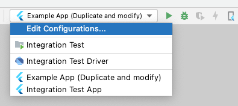

# Ably Flutter Plugin

[](https://github.com/ably/ably-flutter/actions/workflows/check.yaml)
[](https://github.com/ably/ably-flutter/actions/workflows/docs.yml)
[](https://github.com/ably/ably-flutter/actions/workflows/flutter_integration.yaml)

A
[Flutter](https://flutter.dev/)
plugin wrapping the
[ably-cocoa](https://github.com/ably/ably-cocoa) (iOS)
and
[ably-java](https://github.com/ably/ably-java) (Android)
client library SDKs for [Ably](https://www.ably.com),
the platform that powers synchronized digital experiences in realtime.

Ably provides the best infrastructure and APIs to power realtime experiences at scale, delivering billions of realtime messages everyday to millions of end users.
We handle the complexity of realtime messaging so you can focus on your code.

## Resources

- [Quickstart Guide](https://www.ably.com/documentation/quick-start-guide?lang=flutter)
- [Introducing the Ably Flutter plugin](https://www.ably.com/blog/ably-flutter-plugin) by [Srushtika](https://github.com/Srushtika) (Developer Advocate)
- [Building a Realtime Cryptocurrency App with Flutter](https://www.ably.com/tutorials/realtime-cryptocurrency-app-flutter) by [pr-Mais](https://github.com/pr-Mais) and [escamoteur](https://github.com/escamoteur)
- [Building realtime apps with Flutter and WebSockets: client-side considerations](https://www.ably.com/topic/websockets-flutter)

## Supported Platforms

### iOS

iOS 10 or newer.

### Android

API Level 19 (Android 4.4, KitKat) or newer.

_This project uses Java 8 language features, utilising [Desugaring](https://developer.android.com/studio/write/java8-support#library-desugaring)
to support lower versions of the Android runtime (i.e. API Levels prior to 24)_

If your project needs support for SDK Version lower than 24, Android Gradle Plugin 4.0.0+ must be used.
You might also need to upgrade [gradle distribution](https://developer.android.com/studio/releases/gradle-plugin#updating-plugin) accordingly.

## Known Limitations

Features that we do not currently support, but we do plan to add in the future:

- Symmetric encryption ([#104](https://github.com/ably/ably-flutter/issues/104))
- Ably token generation ([#105](https://github.com/ably/ably-flutter/issues/105))
- REST and Realtime Stats ([#106](https://github.com/ably/ably-flutter/issues/106))
- Custom transportParams ([#108](https://github.com/ably/ably-flutter/issues/108))
- Push Notifications Admin ([#109](https://github.com/ably/ably-flutter/issues/109))
- Remember fallback host during failures ([#47](https://github.com/ably/ably-flutter/issues/47))

## Example app

### Running example app

- To run the example app, you need an Ably API key. Create a free account on [ably.com](https://ably.com/) and then use your API key from there in the example app.
- Clone the project

#### Android Studio / IntelliJ Idea

Under the run/ debug configuration drop down menu, click `Edit Configurations...`. Duplicate the `Example App (Duplicate and modify)` configuration. Leave the "Store as project file" unchecked to avoid committing your Ably API key into a repository. Update this new run configuration's `additional run args` with your ably API key. Run or debug the your new run/ debug configuration.




#### Visual Studio Code

- Under `Run and Debug`,
  - Select the gear icon to view `launch.json`
  - Add your Ably API key to the `configurations.args`, i.e. replace `replace_with_your_api_key` with your own Ably API key.
  - To choose a specific device when more than one are connected: to launch on a specific device, make sure it is the only device plugged in. To run on a specific device when you have multiple plugged in, add another element to the `configuration.args` value, with `--device-id=replace_with_device_id`
    - Make sure to replace `replace_with_your_device` with your device ID from `flutter devices`
-  select the `example` configuration

#### Command Line using the Flutter Tool

- Change into the example app directory: `cd example`
- Install dependencies: `flutter pub get`
- Launch the application: `flutter run --dart-define ABLY_API_KEY=put_your_ably_api_key_here`, remembering to replace `put_your_ably_api_key_here` with your own API key.
  - To choose a specific device when more than one are connected: get your device ID using `flutter devices`, and then running `flutter run --dart-define=ABLY_API_KEY=put_your_ably_api_key_here --device-id replace_with_device_id`

### Push Notifications

See [PushNotifications.md](PushNotifications.md) for detailed information on getting PN working with the example app.

### Troubleshooting

- Running on simulator on M1 macs:
  - Flutter has added support for running apps on the [iOS simulator](https://github.com/flutter/flutter/pull/85059) running on M1 architecture, but this is not yet available on the stable branch. In the mean time, you can change the iOS target to build for Mac in Xcode.
- `fatal error: 'ruby/config.h' file not found`: Ruby is required to install cocoapods and other tools which are used in the build process, and your machine may not have a supported version. To install an up-to-date version of Ruby:
  - Run `brew install rbenv ruby-build`
  - Install [rbenv](https://github.com/rbenv/rbenv#installation):
    - Run `rbenv init` (and follow its recommended instructions)
    - Run `rbenv install 3.0.1`
  - Run `sudo gem install cocoapods ffi`
    - Why do we need `ffi`?: https://github.com/CocoaPods/CocoaPods/issues/9907#issuecomment-729980327

## Usage

### Specify Dependency

Package home:
[pub.dev/packages/ably_flutter](https://pub.dev/packages/ably_flutter)

See:
[Adding a package dependency to an app](https://flutter.dev/docs/development/packages-and-plugins/using-packages#adding-a-package-dependency-to-an-app)

### Import the package

```dart
import 'package:ably_flutter/ably_flutter.dart' as ably;
```

### Ensure `WidgetsBinding` is initialized

In your `main` function, call `WidgetsFlutterBinding.ensureInitialized();`. 
Make sure to do this before calling any methods from the `ably_flutter` package. 
This is done to ensure all platform methods will be successfully received by the native Ably plugin on the host platform.

### Configure a Client Options object

For guidance on selecting an authentication method (basic authentication vs. token authentication), read [Selecting an authentication mechanism](https://ably.com/documentation/core-features/authentication/#selecting-auth).

Authenticating using [basic authentication/ API key](https://ably.com/documentation/core-features/authentication/#basic-authentication) (for running example app/ test apps and not for production)

```dart
// Specify your apiKey with `flutter run --dart-define=ABLY_API_KEY=replace_your_api_key`
final String ablyApiKey = const String.fromEnvironment(Constants.ablyApiKey);
final clientOptions = ably.ClientOptions.fromKey(ablyApiKey);
clientOptions.logLevel = ably.LogLevel.verbose;  // optional
```

Authenticating using [token authentication](https://ably.com/documentation/core-features/authentication/#token-authentication)

```dart
// Used to create a clientId when a client first doesn't have one. 
// Note: you should implement `createTokenRequest`, which makes a request to your server that uses your Ably API key directly.
final clientOptions = ably.ClientOptions()
// ..clientId = _clientId // Optionally set the clientId
  ..autoConnect = false
  ..authCallback = (TokenParams tokenParams) async {
    try {
      // If a clientId was set in ClientOptions, it will be available in Ably.TokenParams.
      final tokenRequestMap =
      await createTokenRequest(tokenParams: tokenParams);
      return ably.TokenRequest.fromMap(tokenRequestMap);
    } catch (e) {
      print("Something went wrong in the authCallback:");
      print(e);
    }
  };
this._ablyClient = new ably.Realtime(options: clientOptions);
await this._ablyClient.connect();
```

### Using the REST API

Creating the REST client instance:

```dart
ably.Rest rest = ably.Rest(options: clientOptions);
```

Getting a channel instance

```dart
ably.RestChannel channel = rest.channels.get('test');
```

Publishing messages using REST:

```dart
// both name and data
await channel.publish(name: "Hello", data: "Ably");

// just name
await channel.publish(name: "Hello");

// just data
await channel.publish(data: "Ably");

// an empty message
await channel.publish();
```

Get REST history:

```dart
void getHistory([ably.RestHistoryParams params]) async {
  // getting channel history, by passing or omitting the optional params
  var result = await channel.history(params);

  var messages = result.items;        // get messages
  var hasNextPage = result.hasNext(); // tells whether there are more results
  if (hasNextPage) {    
    result = await result.next();     // will fetch next page results
    messages = result.items;
  }
  if (!hasNextPage) {
    result = await result.first();    // will fetch first page results
    messages = result.items;
  }
}

// history with default params
getHistory();

// sorted and filtered history
getHistory(ably.RestHistoryParams(direction: 'forwards', limit: 10));
```

Get REST Channel Presence:

```dart
void getPresence([ably.RestPresenceParams params]) async {
  // getting channel presence members, by passing or omitting the optional params
  var result = await channel.presence.get(params);

  var presenceMembers = result.items; // returns PresenceMessages
  var hasNextPage = result.hasNext(); // tells whether there are more results
  if (hasNextPage) {
    result = await result.next();     // will fetch next page results
    presenceMembers = result.items;
  }
  if (!hasNextPage) {
    result = await result.first();    // will fetch first page results
    presenceMembers = result.items;
  }
}

// getting presence members with default params
getPresence();

// filtered presence members
getPresence(ably.RestPresenceParams(
  limit: 10,
  clientId: '<clientId>',
  connectionId: '<connectionID>',
));
```

Get REST Presence History:

```dart
void getPresenceHistory([ably.RestHistoryParams params]) async {

  // getting channel presence history, by passing or omitting the optional params
  var result = await channel.presence.history(params);

  var presenceHistory = result.items; // returns PresenceMessages
  var hasNextPage = result.hasNext(); // tells whether there are more results
  if (hasNextPage) {
    result = await result.next();     // will fetch next page results
    presenceHistory = result.items;
  }
  if (!hasNextPage) {
    result = await result.first();    // will fetch first page results
    presenceHistory = result.items;
  }
}

// getting presence members with default params
getPresenceHistory();

// filtered presence members
getPresenceHistory(ably.RestHistoryParams(direction: 'forwards', limit: 10));
```

### Using the Realtime API

Creating the Realtime client instance:

```dart
ably.Realtime realtime = ably.Realtime(options: clientOptions);
```

Listening for connection state change events:

```dart
realtime.connection
  .on()
  .listen((ably.ConnectionStateChange stateChange) async {
    print('Realtime connection state changed: ${stateChange.event}');
    setState(() {
      _realtimeConnectionState = stateChange.current;
    });
});
```

Listening for a particular connection state change event (e.g. `connected`):

```dart
realtime.connection
  .on(ably.ConnectionEvent.connected)
  .listen((ably.ConnectionStateChange stateChange) async {
    print('Realtime connection state changed: ${stateChange.event}');
    setState(() {
      _realtimeConnectionState = stateChange.current;
    });
});
```

Creating a Realtime channel instance:

```dart
ably.RealtimeChannel channel = realtime.channels.get('channel-name');
```

Listening for channel events:

```dart
channel.on().listen((ably.ChannelStateChange stateChange) {
  print("Channel state changed: ${stateChange.current}");
});
```

Attaching to the channel:

```dart
await channel.attach();
```

Detaching from the channel:

```dart
await channel.detach();
```

Subscribing to messages on the channel:

```dart
var messageStream = channel.subscribe();
var channelMessageSubscription = messageStream.listen((ably.Message message) {
  print("New message arrived ${message.data}");
});
```

Use `channel.subscribe(name: "event1")` or `channel.subscribe(names: ["event1", "event2"])` to listen to specific named messages.

UnSubscribing from receiving messages on the channel:

```dart
await channelMessageSubscription.cancel();
```

Publishing channel messages

```dart
// both name and data
await channel.publish(name: "event1", data: "hello world");
await channel.publish(name: "event1", data: {"hello": "world", "hey": "ably"});
await channel.publish(name: "event1", data: [{"hello": {"world": true}, "ably": {"serious": "realtime"}]);

// single message
await channel.publish(message: ably.Message()..name = "event1"..data = {"hello": "world"});

// multiple messages
await channel.publish(messages: [
  ably.Message()..name="event1"..data = {"hello": "ably"},
  ably.Message()..name="event1"..data = {"hello": "world"}
]);
```

Get Realtime history

```dart
void getHistory([ably.RealtimeHistoryParams params]) async {
  var result = await channel.history(params);

  var messages = result.items;        // get messages
  var hasNextPage = result.hasNext(); // tells whether there are more results
  if (hasNextPage) {    
    result = await result.next();     // will fetch next page results
    messages = result.items;
  }
  if (!hasNextPage) {
    result = await result.first();    // will fetch first page results
    messages = result.items;
  }
}

// history with default params
getHistory();

// sorted and filtered history
getHistory(ably.RealtimeHistoryParams(direction: 'forwards', limit: 10));
```

Enter Realtime Presence:

```dart
await channel.presence.enter();

// with data
await channel.presence.enter("hello");
await channel.presence.enter([1, 2, 3]);
await channel.presence.enter({"key": "value"});

// with Client ID
await channel.presence.enterClient("user1");

// with Client ID and data
await channel.presence.enterClient("user1", "hello");
await channel.presence.enterClient("user1", [1, 2, 3]);
await channel.presence.enterClient("user1", {"key": "value"});
```

Update Realtime Presence:

```dart
await channel.presence.update();

// with data
await channel.presence.update("hello");
await channel.presence.update([1, 2, 3]);
await channel.presence.update({"key": "value"});

// with Client ID
await channel.presence.updateClient("user1");

// with Client ID and data
await channel.presence.updateClient("user1", "hello");
await channel.presence.updateClient("user1", [1, 2, 3]);
await channel.presence.updateClient("user1", {"key": "value"});
```

Leave Realtime Presence:

```dart
await channel.presence.leave();

// with data
await channel.presence.leave("hello");
await channel.presence.leave([1, 2, 3]);
await channel.presence.leave({"key": "value"});

// with Client ID
await channel.presence.leaveClient("user1");

// with Client ID and data
await channel.presence.leaveClient("user1", "hello");
await channel.presence.leaveClient("user1", [1, 2, 3]);
await channel.presence.leaveClient("user1", {"key": "value"});
```

Get Realtime Presence members:

```dart
var presenceMessages = await channel.presence.get();

// filter by Client Id
var presenceMessages = await channel.presence.get(
  ably.RealtimePresenceParams(
    clientId: 'clientId',
  ),
);

// filter by Connection Id
var presenceMessages = await channel.presence.get(
  ably.RealtimePresenceParams(
    connectionId: 'connectionId',
  ),
);
```

Get Realtime Presence history

```dart
void getPresenceHistory([ably.RealtimeHistoryParams params]) async {
  var result = await channel.presence.history(params);

  var messages = result.items;        // get messages
  var hasNextPage = result.hasNext(); // tells whether there are more results
  if (hasNextPage) {    
    result = await result.next();     // will fetch next page results
    messages = result.items;
  }
  if (!hasNextPage) {
    result = await result.first();    // will fetch first page results
    messages = result.items;
  }
}

// presence history with default params
getPresenceHistory();

// sorted and filtered history
getPresenceHistory(ably.RealtimeHistoryParams(direction: 'forwards', limit: 10));
```

Subscribe to Realtime Presence messages

```dart
// subscribe for all presence actions
channel
  .presence
  .subscribe()
  .listen((presenceMessage) {
    print(presenceMessage);
  },
);

// subscribe for specific action
channel
  .presence
  .subscribe(action: PresenceAction.enter)
  .listen((presenceMessage) {
    print(presenceMessage);
  },
);

// subscribe for multiple actions
channel
  .presence
  .subscribe(actions: [
    PresenceAction.enter,
    PresenceAction.update,
  ])
  .listen((presenceMessage) {
    print(presenceMessage);
  },
);
```

### Push Notifications

See [PushNotifications.md](PushNotifications.md) for detailed information on using PN with this plugin.

## Caveats

### RTE6a compliance

Using the Streams based approach doesn't fully conform with
[RTE6a](https://docs.ably.com/client-lib-development-guide/features/#RTE6a)
from our
[client library features specification](https://docs.ably.com/client-lib-development-guide/features/).

#### The Problem

```dart
StreamSubscription subscriptionToBeCancelled;

// Listener registered 1st
realtime.connection.on().listen((ably.ConnectionStateChange stateChange) async {
  if (stateChange.event == ably.ConnectionEvent.connected) {
    await subscriptionToBeCancelled.cancel();       // Cancelling 2nd listener
  }
});

// Listener registered 2nd
subscriptionToBeCancelled = realtime.connection.on().listen((ably.ConnectionStateChange stateChange) async {
  print('State changed');
});
```

In the example above, the 2nd listener is cancelled when the 1st listener is notified about the "connected" event.
As per
[RTE6a](https://docs.ably.com/client-lib-development-guide/features/#RTE6a),
the 2nd listener should also be triggered.
It will not be as the 2nd listener was registered after the 1st listener and stream subscription is cancelled immediately after 1st listener is triggered.

This wouldn't have happened if the 2nd listener had been registered before the 1st was.

However, using a neat little workaround will fix this...

#### The Workaround - Cancelling using delay

Instead of `await subscriptionToBeCancelled.cancel();`, use

```dart
Future.delayed(Duration.zero, () {
    subscriptionToBeCancelled.cancel();
});
```

## Contributing

For guidance on how to contribute to this project, see [CONTRIBUTING.md](CONTRIBUTING.md).
